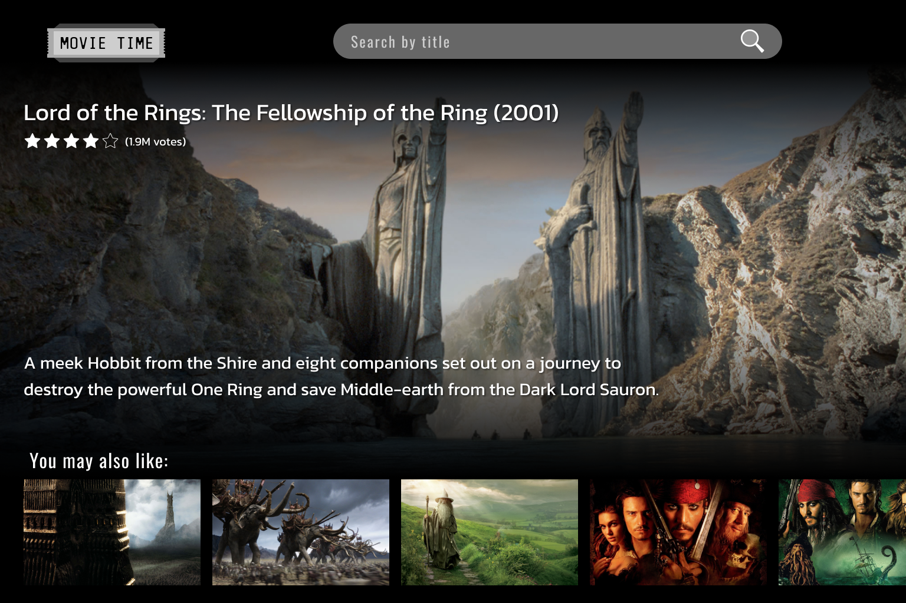

# Movie Time

_Movie Time_ is a web app that may help you find interesting movies.

**Project is not done yet**

## Table of Contents

- [Preview](#features)
- [Features](#features)
- [Technologies](#technologies)
- [Planned Features](#planned-features)
- [License](#license)
- [Credits](#credits)

## Preview

Desktop:

Mobile:

[Check the full project on Figma](https://www.figma.com/file/K0jRHRRglZOLEFHS8w4QII/MovieTime?type=design&node-id=0%3A1&t=NXPpmJEwWlOnn0fa-1)

## Features

**Project has no interactivity yet. It consists of static data only.**

All the data will come from [**The Movie Database (TMDB) API**](https://developer.themoviedb.org/docs)

## Technologies

- React 18
- JavaScript
- Sass
- Vite
- HTML

## Planned Features

- on load, display a randomly picked movie and similar productions below
- searching by title
- displaying list of the newest, most popular or upcoming movies
- searching by genre
- browsing TV shows

## License

[MIT License](/LICENSE)

## Credits

- The app's layout and basic mechanism was inpired by the [_react-tv-show-adviser_](https://github.com/codiku/react-tv-show-adviser) by [**Robin Lebhar**](https://github.com/codiku), which is a project realized during his course on _Udemy_.

  - I redesigned this project using [Figma](https://www.figma.com/file/K0jRHRRglZOLEFHS8w4QII/MovieTime?type=design&node-id=0%3A1&t=NXPpmJEwWlOnn0fa-1) and wrote all the code from scratch.

- [Popcorn icon](https://www.flaticon.com/free-icons/popcorn) (favicon) created by [Adib Sulthon](https://www.flaticon.com/authors/adib-sulthon) - Flaticon</a>
